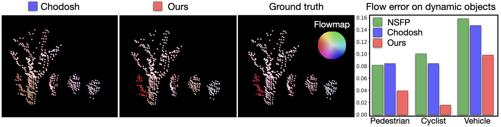
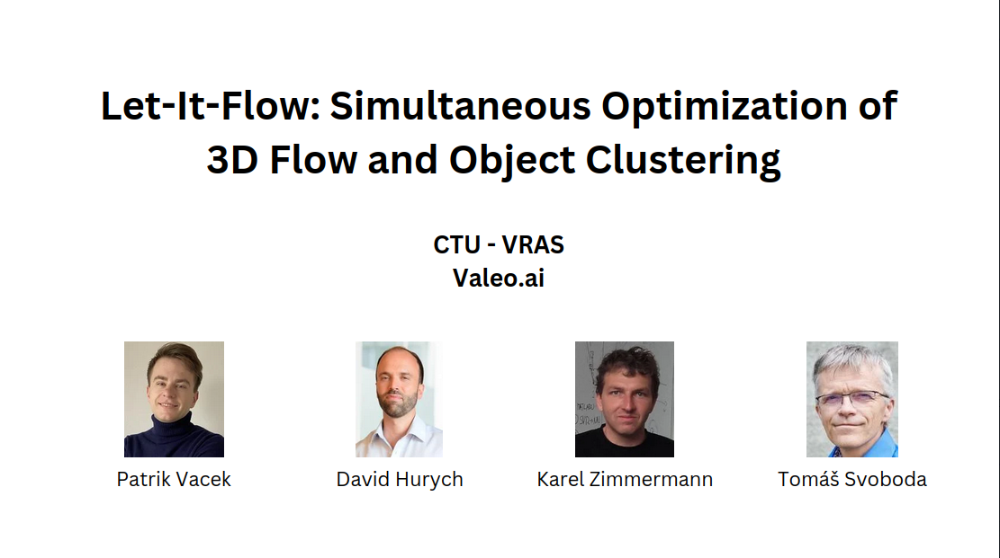
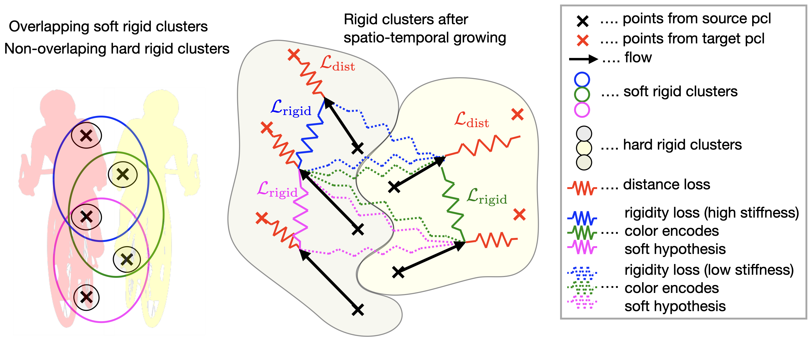

<h2 align="center"><strong>Let It Flow: Simultaneous Optimization of 3D Flow and Object Clustering</strong></h3>
 
<p align="center">
  
</p>
  
  <p align="center">
    <a href="https://github.com/vacany">Patrik Vacek</a><sup>1</sup>&nbsp;&nbsp;&nbsp;
    <a href="https://scholar.google.com/citations?user=XY1PVwYAAAAJ">David Hurych</a><sup>2</sup>&nbsp;&nbsp;&nbsp;
    <a href="https://sites.google.com/view/karelzimermann/">Karel Zimmermann</a><sup>1</sup>&nbsp;&nbsp;&nbsp;
    <!-- <a href="https://scholar.google.com/citations?user=Uq2DuzkAAAAJ">Runnan Chen</a><sup>4</sup>&nbsp;&nbsp;&nbsp; -->
    <a href="https://cmp.felk.cvut.cz/~svoboda/">Tomas Svoboda</a><sup>1</sup><br>
    <!-- <a href="https://scholar.google.com/citations?user=lSDISOcAAAAJ">Liang Pan</a><sup>5</sup>&nbsp;&nbsp;&nbsp; -->
    <!-- <a href="http://chenkai.site">Kai Chen</a><sup>1</sup>&nbsp;&nbsp;&nbsp; -->
    <!-- <a href="https://liuziwei7.github.io">Ziwei Liu</a><sup>5</sup> -->
    <br>
    <sup>1</sup>CTU Deparment of Cybernetics&nbsp;&nbsp;&nbsp;
    <sup>2</sup>Valeo AI&nbsp;&nbsp;&nbsp;
    <!-- <sup>3</sup>The Hong Kong University of Science and Technology&nbsp;&nbsp;&nbsp; -->
    <!-- <sup>4</sup>The University of Hong Kong&nbsp;&nbsp;&nbsp; -->
    <!-- <sup>5</sup>S-Lab, Nanyang Technological University -->
  </p>

</p>

<p align="center">
  <a href="https://arxiv.org/abs/2404.08363" target='_blank'>
    
  <!-- </a> -->
  <!-- <a href="https://ldkong.com/Seal" target='_blank'> -->
    <!--  -->
  <!-- </a> -->  
  <!-- [](https://arxiv.org/abs/<INDEX>) -->
  <!-- <a href="" target='_blank'> -->
    <!--  -->
  <!-- </a> -->

</p>


| :movie_camera: 1-Minute Summary |
| :-: |
|  |
| [Link](https://www.youtube.com/watch?v=rJ7QBZW93wY)|

### :sparkles: Performance
- :rocket: **Scalability:** `Let It Flow` does not require training or supervision as an optimization-based method and works on out-of-distribution data. 
- :rainbow: **Real Scene Flow:** `Let It Flow` performs consistently accross real world benchmark datasets and not only on StereoKITTI. Improvements are observable even on new dynamic/object class error metrics.
- :balance_scale: **Generalizability:** `Let It Flow` does not have to adjust the parameter config for accurate results on the tested datasets.

## Mechanism
<p align="center">
  
</p>

## Installation

Tested with Python==3.10, [PyTorch3d](https://github.com/facebookresearch/pytorch3d), [PyTorch Scatter](https://github.com/rusty1s/pytorch_scatter/tree/master)
See install.sh for installation of libraries or run it directly:

```console
conda create -n let-it-flow python=3.10
conda activate let-it-flow

conda install pytorch=1.13.0 torchvision pytorch-cuda=11.6 -c pytorch -c nvidia
conda install -c fvcore -c iopath -c conda-forge fvcore iopath

git clone https://github.com/facebookresearch/pytorch3d.git
cd pytorch3d && python3 -m pip install -e .
cd ..

conda install pytorch-scatter -c pyg
```
<!-- bash install.sh -->

## Dataset
Download and unpack the [Argoverse2](https://login.rci.cvut.cz/data/lidar_intensity/argoverse2.tgz) preprocessed sequence samples into the `dataset/argoverse2/` path.

```console
tar -xvf argoverse2.tgz datasets/argoverse2/
```

 Set up the config.yaml to include path to the `argoverse2 folder` and path to store the `results`.

## Inference

To infer the model on Argoverse2 dataset sequences, please run the following:

```console
python run_optimization.py
```

The script will store the outputs (and inputs with Ground truth) into the `store_path` for metric calculation.

## Generation of EPE metrics

After the model inference (takes about 2 hours on GPU), generate metrics of `Let It Flow (lif)` by running:

```console
python compute_metrics.py lif
```

Result will print the End-Point-Error per class annotated in Argoverse2 and also overall ThreewayEPE.

## Citation

If you find our work helpful, please consider citing our paper:

```bibtex
@misc{vacek2024lif,
      title={Let It Flow: Simultaneous Optimization of 3D Flow and Object Clustering}, 
      author={Patrik Vacek and David Hurych and Tomáš Svoboda and Karel Zimmermann},
      year={2024},
      eprint={2404.08363},
      archivePrefix={arXiv},
      primaryClass={cs.CV}
}
```
## License
<a rel="license" href="http://creativecommons.org/licenses/by-nc-sa/4.0/"></a>
<br />
This work is under the <a rel="license" href="http://creativecommons.org/licenses/by-nc-sa/4.0/">Creative Commons Attribution-NonCommercial-ShareAlike 4.0 International License</a>.

## Acknowledgement
This work is developed based on the open-source repositories and baselines:
[KISS-ICP](https://github.com/PRBonn/kiss-icp),
[NSFP](https://github.com/Lilac-Lee/Neural_Scene_Flow_Prior/tree/main),
[MBNSFP](https://github.com/kavisha725/MBNSF/tree/main),
[Chodosh](https://github.com/kylevedder/zeroflow)


:heart: We thank to the contributors from the above open-source repositories.
