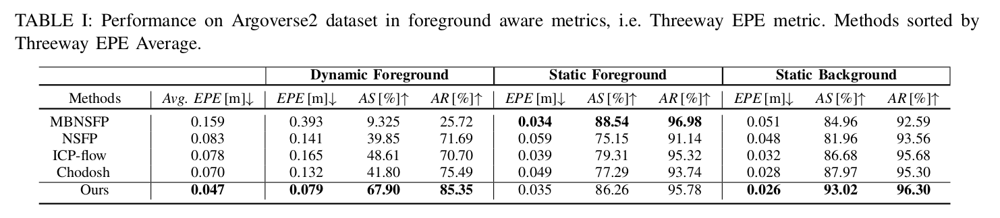

<h2 align="center"><strong>Let It Flow: Simultaneous Optimization of 3D Flow and Object Clustering</strong></h3>
 
<p align="center">
  
</p>
  
  <p align="center">
    <a href="https://github.com/vacany">Patrik Vacek</a><sup>1</sup>&nbsp;&nbsp;&nbsp;
    <a href="https://scholar.google.com/citations?user=XY1PVwYAAAAJ">David Hurych</a><sup>2</sup>&nbsp;&nbsp;&nbsp;
    <a href="https://sites.google.com/view/karelzimermann/">Karel Zimmermann</a><sup>1</sup>&nbsp;&nbsp;&nbsp;
    <!-- <a href="https://scholar.google.com/citations?user=Uq2DuzkAAAAJ">Runnan Chen</a><sup>4</sup>&nbsp;&nbsp;&nbsp; -->
    <a href="https://cmp.felk.cvut.cz/~svoboda/">Tomas Svoboda</a><sup>1</sup><br>
    <!-- <a href="https://scholar.google.com/citations?user=lSDISOcAAAAJ">Liang Pan</a><sup>5</sup>&nbsp;&nbsp;&nbsp; -->
    <!-- <a href="http://chenkai.site">Kai Chen</a><sup>1</sup>&nbsp;&nbsp;&nbsp; -->
    <!-- <a href="https://liuziwei7.github.io">Ziwei Liu</a><sup>5</sup> -->
    <br>
    <sup>1</sup>CTU Deparment of Cybernetics&nbsp;&nbsp;&nbsp;
    <sup>2</sup>Valeo AI&nbsp;&nbsp;&nbsp;
    <!-- <sup>3</sup>The Hong Kong University of Science and Technology&nbsp;&nbsp;&nbsp; -->
    <!-- <sup>4</sup>The University of Hong Kong&nbsp;&nbsp;&nbsp; -->
    <!-- <sup>5</sup>S-Lab, Nanyang Technological University -->
  </p>

</p>

<p align="center">
  <a href="https://arxiv.org/abs/2404.08363" target='_blank'>
    
  <!-- </a> -->
  <!-- <a href="https://ldkong.com/Seal" target='_blank'> -->
    <!--  -->
  <!-- </a> -->  
  <!-- [](https://arxiv.org/abs/<INDEX>) -->
  <!-- <a href="" target='_blank'> -->
    <!--  -->
  <!-- </a> -->

</p>


### :sparkles: Highlight
- :rocket: **Scalability:** `Let It Flow` does not require training or supervision as an optimization-based method and works on out-of-distribution data. 
- :balance_scale: **Consistency:** `Let It Flow` performs consistently accross different benchmark datasets.
- :rainbow: **Generalizability:** `Let It Flow` does not have to adjust the parameter config for accurate results on the tested datasets. Improvements are observable even on new dynamic/object class error metrics.

# Mechanism
<p align="center">
  
</p>

# Installation

Tested with version of Python == 3.10, [PyTorch3d](https://github.com/facebookresearch/pytorch3d), [PyTorch Scatter](https://github.com/rusty1s/pytorch_scatter/tree/master)
See install.sh for installation of libraries or run it directly:

```console
conda create -n let-it-flow python=3.10
conda activate let-it-flow

conda install pytorch=1.13.0 torchvision pytorch-cuda=11.6 -c pytorch -c nvidia
conda install -c fvcore -c iopath -c conda-forge fvcore iopath

git clone https://github.com/facebookresearch/pytorch3d.git
cd pytorch3d && python3 -m pip install -e .
cd ..

conda install pytorch-scatter -c pyg
```
<!-- bash install.sh -->

# DATA
Download and unpack the [Argoverse2](https://login.rci.cvut.cz/data/lidar_intensity/argoverse2.tgz) preprocessed sequence samples into the `dataset/argoverse2/` path.

```console
tar -xvf argoverse2.tgz datasets/argoverse2/
```

 Set up the config.yaml to include path to the `argoverse2 folder` and path to store the `results`.


<!-- https://fletcher.github.io/MultiMarkdown-4/tables -->

<p align="center">
  
</p>

<!-- |||| Dynamic Foreground ||| Static Foreground ||| Static Background || 
|-|-|-|:----:|:---:|---|---|---|---|---|---|
| Methods | Avg. EPE m | EPE [m]↓ | AS [%]↑ | AR [%]↑ | EPE [m]↓ | AS [%]↑ | AR [%]↑ | EPE [m]↓ | AS [%]↑ | AR [%]↑ |
<!-- |MBNSFP [37] | 1 | 1 |1 |1 |1 |1 |1 |1 |1 |1| -->
 <!-- -->


<!-- NSFP [20]
ICP-flow [23]
Chodosh [7]
Ours 0.159
0.083
0.078
0.070
0.047 0.393
0.141
0.165
0.132
0.079 9.325
39.85
48.61
41.80
67.90 25.72
71.69
70.70
75.49
85.35 0.034
0.059
0.039
0.049
0.035 88.54
75.15
79.31
77.29
86.26 96.98
91.14
95.32
93.74
95.78 0.051
0.048
0.032
0.028
0.026 84.96
81.96
86.68
87.97
93.02 92.59
93.56
95.68
95.30
96.30 -->